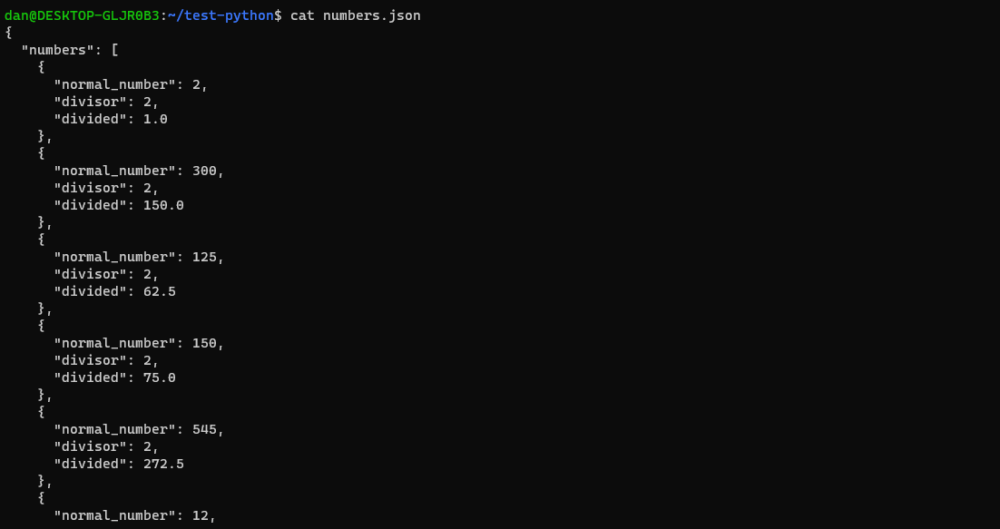
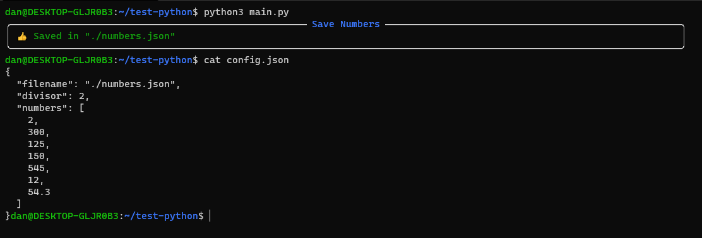

# Divided Numbers Python.


__This is a program made with python for save numbers in json file, divided for other number.__


__The values for make the operation is the file "config.json". Here is the configuration for get the output.__


## Installation.

__Cloning the repository and install dependencies.__


```bash
git clone https://EduardYan/divided-numbers-python.git

cd divided-numbers-python

```

### Dependencies.

In this case installing with pip, other package administrator is well.


```bash
pip3 install -r requirements.txt
```


## Use.

Using the config.json, you can configurate the numbers to save and you divisor.


Basic configuration:
* __filename__
  The file to save the output. The path is diferent in Unix and Windows!.

* __divisor__
  The divisor to divide the numbers. The number must be a integer or decimal.

* __numbers__
  The numbers for divide. These numbers must be decimals or integers numbers.

```json
{
  "filename": "./numbers.json",
  "divisor": 2,
  "numbers": [
    2,
    300,
    125,
    150,
    545,
    12,
    54.3
  ]
}
```

__After of the configuration execute:__

```bash
python3 main.py
```

And the numbers divided, is in the filename in the config file.



## Screenshot.



## Errors or Bugs.
<a href="mailto:eduarygp@gmail.com">Contact Me.</a>